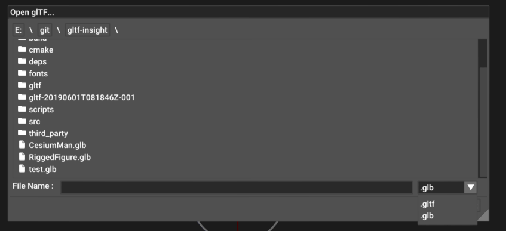

# ImGuiFileDialog

A File selection dialog for ImGui. Supports browsing and filters.

# Features

- Display and navigate diretories
- Keyboard navigation possible : 
  - Text input field is keyboard focused
  - Tab completion
  - When "Return" is pressed and input matches a file, file dialog validate the selection
  - When "Return" is pressedn and validate a directory name or link, navigate to that directory
  - ".." works as a directory to go to the parent one. typing ".." then RETURN will jump to parent directory
- Can costumize the string That is used to denote in the listing of the an entry is a `directory`, a `file` or a `symlink`
 - You can use this feature in conjonction with a symbolic font to acheive prettier results (see screenshot below)




## Compatibility

This widget uses the POSIX `dirent` API, and ships with a Windows implementation made by tronkko (MIT license).

This sould work on Windows, and all the other unix platforms without any issue.

Compatibility has been checked under Windows and Linux.

|Platform|Master Build Status|
|:-------------|----------:|
|  Windows (AppVeyor MSVC 2019) | [](https://ci.appveyor.com/project/Ybalrid/imguifiledialog)|
| Linux (Travis GCC Xenial) | [](https://travis-ci.com/Ybalrid/ImGuiFileDialog)|


## How to use

The ImGuiFileDialog widget itself is located under the file_dialog folder. Just add theses files to your project using the same method you would use to add Dear ImGui itself.

To be able to build the demo itself, you need to initialize all the git submodules:

```bash
git submodule update --init --recursive
```

All the other files in this repository is the code to a test program. You can build it to play with it, and reference the calls in "main.cpp" to see how the API works.

### Changing text or using icone for item type

When exploring for files, the dialog shows a listing in the middle of the window. To differenciate between types, that listing uses strings to indicate if the file is a directory, a regular file, or a link.
By default theses strings are :
 - `"[Dir]"`
 - `"[File]"`
 - `"[Link]"`

To change these, simply use any string literal. I suggest you to go read the [instruction about using custom fonts with ImGui], it contains suggestions about how to use fonts containing icons with ImGui easilly.
The screenshot at the top of this README uses a merged font with Ionic icons and Google Roboto Regular (non monospaced).

```cpp
  ImGuiFileDialog::fileLabel = ICON_II_ANDROID_DOCUMENT;
  ImGuiFileDialog::dirLabel = ICON_II_ANDROID_FOLDER;
  ImGuiFileDialog::linkLabel = ICON_II_ANDROID_ARROW_FORWARD;
```

CMakeFiles here will build the test program

## Examples
An example of the File Dialog integrated within the ImGui Demo App


Another animated gif :


