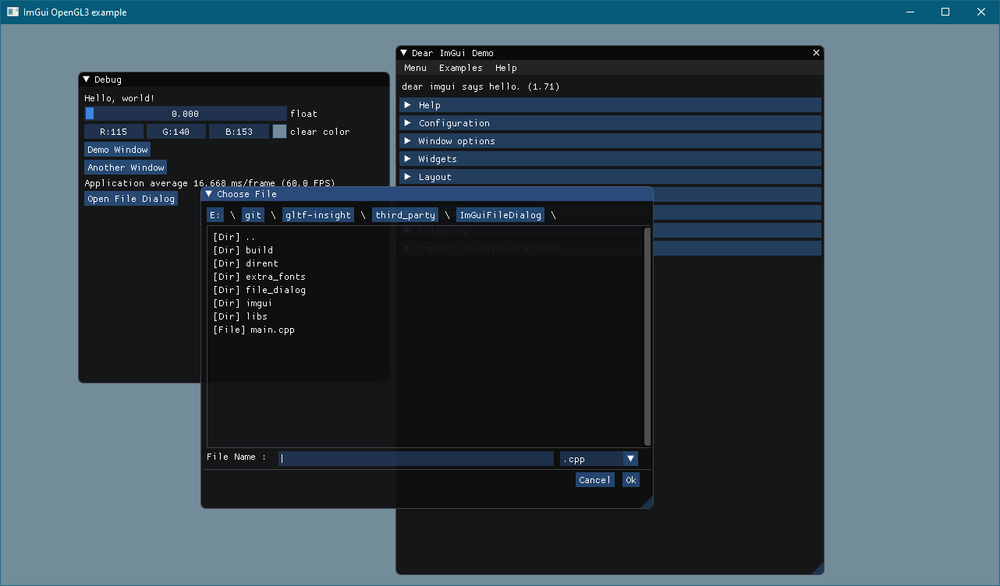
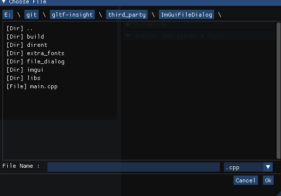

# ImGuiFileDialog

A File selection dialog for ImGui. Supports browsing and filters.

## Compatibility

This widget uses the POSIX `dirent` API, and ships with a Windows implementation made by tronkko (MIT license).

This sould work on Windows, and all the other unix platforms without any issue.

Compatibility has been checked under Windows and Linux.

## How to use

The ImGuiFileDialog widget itself is located under the file_dialog folder. Just add theses files to your project using the same method you would use to add Dear ImGui itself.

To be able to build the demo itself, you need to initialize all the git submodules:

```bash
git submodule update --init --recursive
```

All the other files in this repository is the code to a test program. You can build it to play with it, and reference the calls in "main.cpp" to see how the API works.

## Examples
An example of the File Dialog integrated within the ImGui Demo App



Another animated gif :


